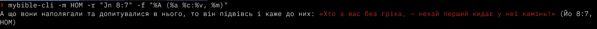

# About

`mybible-cli.py` is a command line utility to query [MyBible.zone](https://mybible.zone/en/) modules. It has been inspired by [diatheke](https://wiki.crosswire.org/Frontends:Diatheke) – a command line utility for [Crosswire Sword](http://www.crosswire.org/sword/index.jsp) modules.
The main goal of `mybible-cli.py` is only to get the required text, not to perform search or analyze the matched data, as there are other tools that can do that. The output of the tool can be piped, so there are limitless possibilities to do whatever is needed with the output text.
Though MyBible module format specification describes more than one module type, the script work only with Bible modules. Any other modules (commentaries, devotions, plans, etc.) will be invisible to the script. A good place to get modules is [ph4.org website](https://www.ph4.org/b4_index.php?hd=b).

# Installation

`mybible-cli.py` is a self-contained script with no dependencies on anything other than Python 3.12. No installation is required, the script can run from anywhere. If you find it useful, though, it might be better to copy or symlink it anywhere in your $PATH (%PATH%).
Here's one of the ways to do it:

```  bash
git clone https://github.com/kosivantsov/mybible-cli.git
cd mybible-cli
chmod +x mybible-cli
ln -s $(pwd)/mybible-cli.py $HOME/bin/mybible-cli
```

This way you could run it by simply invoking `mybible-cli`, and it would update automatically when you pull changes in your local copy.

If you use MS Windows and don't have Python installed, it's still possible to use the script. Download the [Windows build](https://github.com/kosivantsov/mybible-cli/releases/download/latest/mybible-cli_windows.zip),
unpack somewhere, and run `mybible-cli.exe` in the unpacked folder. When the zip is unpacked, you'll find `mybible-cli.exe` and a subfolder named `_internal`. Both are needed for the program to run.

For the program to be useful (whether as a script or a Windows executable), you must have at least one MyBible module.


# Usage

This script/application can be used directly on the command line, or used in other [scripts and applications](./tools) to get Bible text. Below is a brief overview of its usage on the command line.

## First run

When run for the first time (unless `-h`, `--help`, or `--helpformat` arguments were used), it will ask to specify a path to the folder with MyBible modules. The modules folder can be changed at any time using the `-p`, `--path` argument.

## Help messages

Running the script without any arguments will produce a short help message. Run with `-h`, `--help`, `--helpfomat` to get more details.
<details>
  <summary>Long help message</summary>
<code bash>Options:
  -h, --help
        Shows help message and exits
  -p PATH, --path PATH
        Specify the path to the folder with MyBible modules
  -L, --list-modules
        List available MyBilbe modules
  -m MODULE_NAME, --module-name MODULE_NAME
        Name of the MyBible module to use
  -r REFERENCE, --reference REFERENCE
        Bible reference to output
  -a ABBR, --abbr ABBR
        Get Bible book names and abbreviations from a non-default file.
        With '--abbr uk' a file named 'uk_mapping.json' located in the configuration folder will be used
  -A, --self-abbr
        Get Bible book names and abbreviations from the module itself
  -f FORMAT, --format FORMAT
        Format output with %-prefixed format sting.
        Available placeholders: %f, %a, %c, %v, %t, %T, $z, %A, %Z, %m
  -F SAVE_FORMAT, --save-format SAVE_FORMAT
        Specified format string will be applied and saved as default.
  --helpformat
        Detailed info on the format string
  --noansi
        Clears out any ANSI escape sequences in the Bible verses output (if %A or %Z were used in the format string)
  --open-config-folder
        Opens the config folder
  --open-module-folder
        Opens the folder with MyBible modules
  --j2t &lt;JSON_FILE&gt;, --json-to-tsv &lt;JSON_FILE&gt;
        Converts a json file to tsv (to edit a mapping file)
  --check-tsv &lt;TSV_FILE&gt;
        Reports duplicates in the specified tsv file
  --t2j &lt;TSV_FILE&gt;, --tsv-to-json &lt;TSV_FILE&gt;
        Converts a tsv file to json (to use as a mapping file)</code>
</details>


## Listing available modules

The script can list all the installed modules with `-L`. The list will be sorted by language and will include Bible modules only. When first invoked, it would take a few moments to query each file and get the required info. That info is then hashed and reused until modules are changed.

<div align="center"></div>

## Getting text of a Bible reference

The most common usage would be calling the script with a module name and a reference to get the required text:  
`mybible-cli -m "KJV+" -r "Jn 11:35"`  
If a parameter passed to the script contains a space or a character that can have a special meaning for the shell, it needs to be quoted.  
The script understands only the colon Bible notation without letters and parenthesis in the chapter and verse part. Chapter and verse numbers could be omitted to output an entire book or chapter. Blocks should be separated by commas or semicolons. Ranges are marked with a minus. Spaces in ranges are permitted. Periods will be ignored.

## Output format

The script outputs each verse on a separate line and formats it using a format string with %-prefixed placeholders.  
To learn what each placeholder means, run `mybible-cli --helpformat`.

The default format is <strong>`%f %c:%v: %t (%m)`</strong> (full book name, chapter:verse\: text without most MyBible markup, module name in parenthesis): `John 11:35: Jesus wept. (KJV+)`.
A format string specified with `-f` is applied only once. With `-F`, the specified format string will be saved as default and used when no format string is given explicitly.

Text of the reference can be output in five different ways:
1. `%T`- raw text with all the markup as in the module itself
1. `%t` - plain text, no Strong's numbers, no other markup, but with line breaks and indentations as marked in the module; with notes
1. `%z` – the same as above, but without line breaks and indentations marked in the module; notes removed
1. `%A` – MyBible markup is converted to ANSI escape sequences for pretty output in the terminal. Includes Strong's numbers
1. `%Z` – the same as above, but without Strong's numbers  
   If you need Strong's numbers in the output, but don't want to get the escape sequences (for instance, when you pipe output of the script), there is an option `--noansi`. It has no effect on the output when the text is not formatted with `%A` or `%Z`.




## Bible book names and abbreviations

Bible book names and abbreviations are looked up in a list provided within the script. During the first run, the list is saved as `mapping.json` in the configuration directory and could be used to create custom lookup lists.

If you want to use book names and abbreviations from the module itself, run the script with the `-A` argument. To use a non-default lookup list, use `-a prefix`. In that case, the script will try to use `prefix_mapping.json` in the config folder.
`prefix` can be an arbitrary string but a file name with that prefix should exist, otherwise the default lookup file is used.

The script has three arguments to help with creating custom files to look up Bible names:
* `--j2t`, `--json-to-tsv`: converts json to tsv which can be open and edited in a spreadsheet application
* `--t2j`, `--tsv-to-json`: converts tsv with edited data to json to be used with `-l` argument
* `--check-tsv`: finds and reports duplicates in a tsv file

`json-to-tsv` and `tsv-to-json` output the converted file in the same location as the input file, with the same file name but different extension. No check for file extensions or data is performed during conversion, so it's possible to convert wrong data to wrong formats.

## Accessing config and MyBible modules folders

The script allows opening its config folder and the folder with the MyBible modules in the default file manager. There are two arguments for that:
* `--open-config-folder`
* `--open-module-folder`

## Localized version of the script

This script's UI strings can be localized. The script will read its localization from a file `l10n/<lang>.properties` located in the configuration folder, where `<lang>` is a language code. If there is a .properties file with the same filename as the system's locale language code that file will be used. Any strings missing from the file will be output as they are hardcoded in the script. At the moment, only `en.properties` and `uk.properties` are available. Localization files have to be copied manually. 

# Building an executable to run without Python installation

The script doesn't require to be built on GNU/Linux and macOS since these OSes have Python installed by default. On Windows with Python installed the script can run as is, without building.
If you need to build a binary that will run without Python being installed on your system, it can be done with `pyinstaller`. Included you'll find the spec file. `pyinstaller` is not needed for the script to function,
it's only purpose is to compile the script into a binary.
1. Create a new venv: `python3.12 -m venv $HOME/pyinstaller-venv`
1. Activate the venv: `source $HOME/pyinstaller-venv/Scripts/activate` or `cd $HOME; .\pyinstaller-venv\Scripts\activate`
1. Install pyinstaller: `pip3 install pyinstaller`
1. Go to `mybible-cli` source folder and build the binary: `cd src/mybible-cli; pyinstaller mybible-cly.spec`

A folder with the executable and its dependencies will be found under `dist` subfolder.
